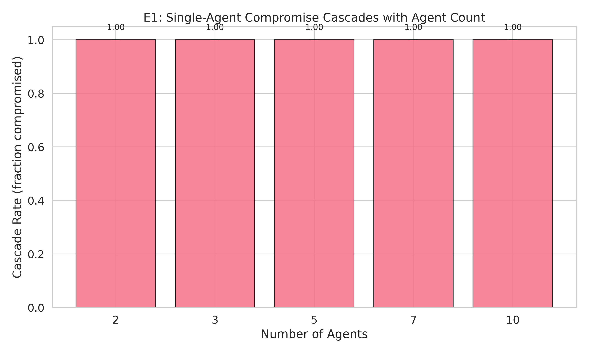
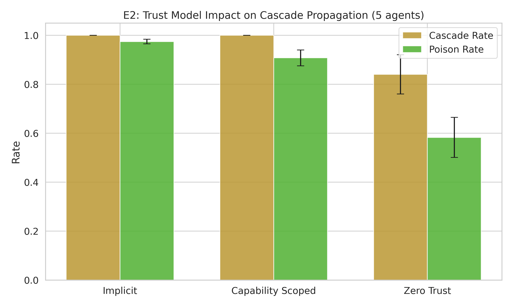
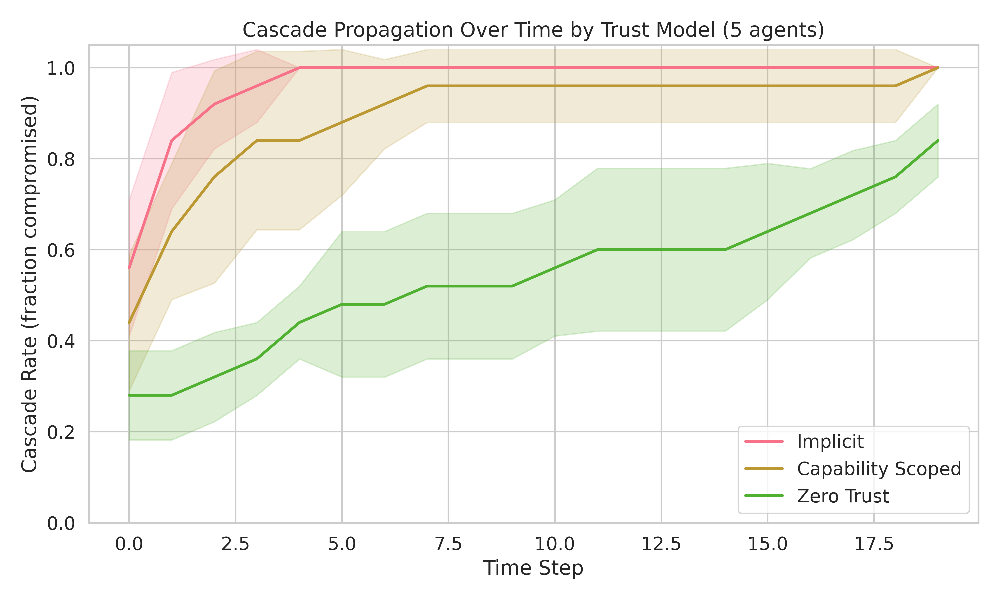
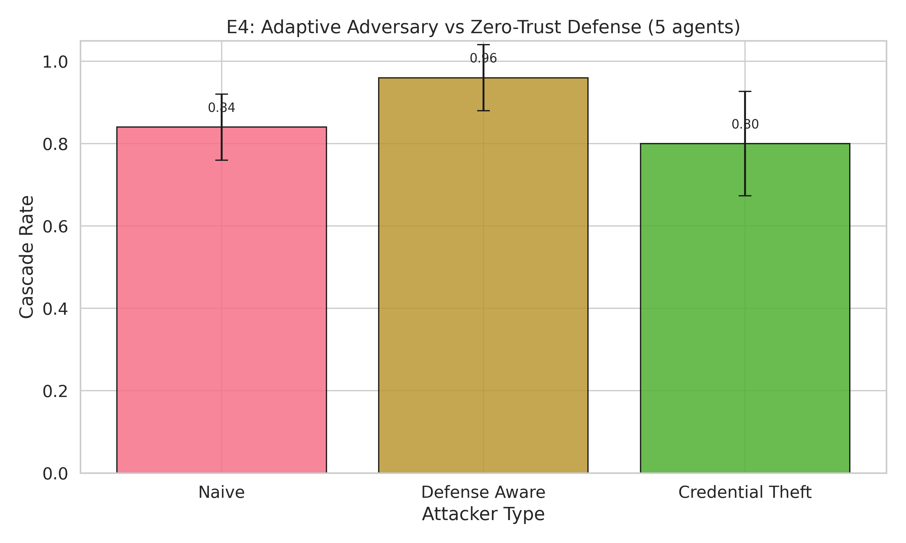

# Your Multi-Agent System Has a 97% Poison Rate — Here's the Only Defense That Works

I built a multi-agent security testing framework and ran 6 experiments across 5 seeds to find out what happens when one agent in a system gets compromised. The results surprised me — and 4 out of 6 of my predictions were wrong.

## What I Built

A simulation-based testbed that models multi-agent systems with configurable trust architectures, network topologies, attacker types, and agent compositions. One agent gets compromised. We measure how poisoned outputs cascade through the system.

Three trust models (implicit, capability-scoped, zero-trust). Three topologies (hierarchical, flat, star). Three attacker types (naive, defense-aware, credential-theft). Five seeds per experiment. 16 passing tests.

## The Headline: Implicit Trust = Zero Containment

Under implicit trust — the default in CrewAI, AutoGen, and most multi-agent frameworks — a single compromised agent cascades to 100% of the system. Every agent compromised. 97.4% of all decisions poisoned. This holds whether you have 2 agents or 10.

If your multi-agent system uses implicit trust (and most do), you have zero containment. Adding more agents doesn't help. Reorganizing the network doesn't help.

## The Only Defense: Zero-Trust

Zero-trust architecture — where each agent independently verifies every input regardless of source — is the only model that actually reduces cascade.

| Trust Model | Cascade Rate | Poison Rate |
|---|---|---|
| Implicit | 100% | 97.4% |
| Capability-scoped | 100% | 90.8% |
| **Zero-trust** | **84%** | **58.3%** |

Zero-trust cuts the poison rate by 40 percentage points. Capability-scoping only manages 7pp. This is the same zero-trust principle from network security, applied to AI agent architectures.

## The Bad News: Adaptive Adversaries Recover 54%

Here's where it gets uncomfortable. A defense-aware attacker — one who knows you're using zero-trust and crafts outputs that pass verification — recovers most of the advantage.

| Attacker | Cascade Rate | Poison Rate |
|---|---|---|
| Naive (vs zero-trust) | 84% | 58.3% |
| **Defense-aware** | **96%** | **89.9%** |
| Credential-theft | 80% | 61.7% |

The defense-aware attacker pushes poison rate from 58% back up to 90% — recovering 54% of the gap zero-trust created. Credential theft is surprisingly less effective than defense-awareness. **It's not who you are that matters in agent trust — it's what you say.**

## What Doesn't Matter (4 Negative Results)

I was wrong about 4 out of 6 predictions. These negative results are more valuable than the confirmations:

1. **Topology doesn't matter.** Hierarchical, flat, and star all reach 100% cascade. Reorganizing your agent network won't help.
2. **Agent type doesn't matter.** All-LLM, mixed RL+LLM, rule-based — all produce identical cascade dynamics.
3. **Memory isolation barely helps.** Shared vs isolated memory: 1.2pp difference. The delegation channel dominates.
4. **Credential theft < defense-awareness.** Stealing an agent's identity is less effective than understanding the defense.

## What This Means for Practitioners

1. **If you're building multi-agent systems: implement zero-trust now.** The default implicit trust in every major framework provides zero containment.
2. **Zero-trust is necessary but not sufficient.** Adaptive adversaries recover 54% of the defense. You need defense-in-depth: zero-trust + anomaly detection + rate limiting.
3. **Don't waste time on topology or agent type.** The cascade dynamics are dominated by trust model, not network structure.
4. **Focus on output quality, not identity.** Credential-theft is less dangerous than an attacker who crafts convincing outputs.

The framework is open source. 16 tests, 5 seeds, full reproducibility.

## Limitations

**This is a simulation, not a real LLM agent system.** The cascade dynamics model agent interaction probabilistically. Real agents may behave differently. The simulation establishes the framework; real-agent validation is next.

**Fixed parameters.** The base cascade probability was tuned for differentiation. Real-world rates depend on LLM capability and task complexity.

**5 agents maximum in most experiments.** Larger systems (50-100 agents) may exhibit different cascade dynamics — partition effects, natural firebreaks, or communication bottlenecks that slow propagation.

**Single initial compromise.** All experiments start with exactly 1 compromised agent. Multi-point compromise (2+ initial attackers) may produce qualitatively different dynamics — potentially faster cascade or cross-topology interactions that our single-attacker model doesn't capture.

## What's Next

**Real LLM agents.** Replace the simulation with actual Claude/GPT agents running in CrewAI. Validate that the simulation findings hold with real language models.

**Larger scale.** Test with 20-50 agents to look for partition effects and natural firebreaks.

**Defense-in-depth.** Combine zero-trust with anomaly detection, output monitoring, and rate limiting to counter adaptive adversaries. The E4 results show that zero-trust alone is necessary but not sufficient — a defense-aware attacker recovers 54% of the poison rate gap, so additional layers are needed.

**Governance innovation.** This is the first project built with Gate 0.5 (Experimental Design Review) + R34 (Tier 2 Depth Escalation) from [govML](https://github.com/rexcoleman/govML). Every hypothesis, baseline, and kill shot was pre-registered before running a single experiment. The result: 4/6 hypotheses refuted, and those refutations are the most valuable findings. Designing for rigor from day 1 surfaces negative results that matter.

---

If you're building multi-agent AI systems and want to understand the security implications, check out the [full framework on GitHub](https://github.com/rexcoleman/multi-agent-security). For more AI security research — adversarial evaluation, agent exploitation, and ML governance — subscribe to the newsletter or follow along on [LinkedIn](https://linkedin.com/in/rexcoleman).

---

*Rex Coleman is securing AI from the architecture up. MS Computer Science (Machine Learning) at Georgia Tech. Previously data analytics and enterprise sales at FireEye/Mandiant. CFA charterholder. Creator of [govML](https://github.com/rexcoleman/govML).*
